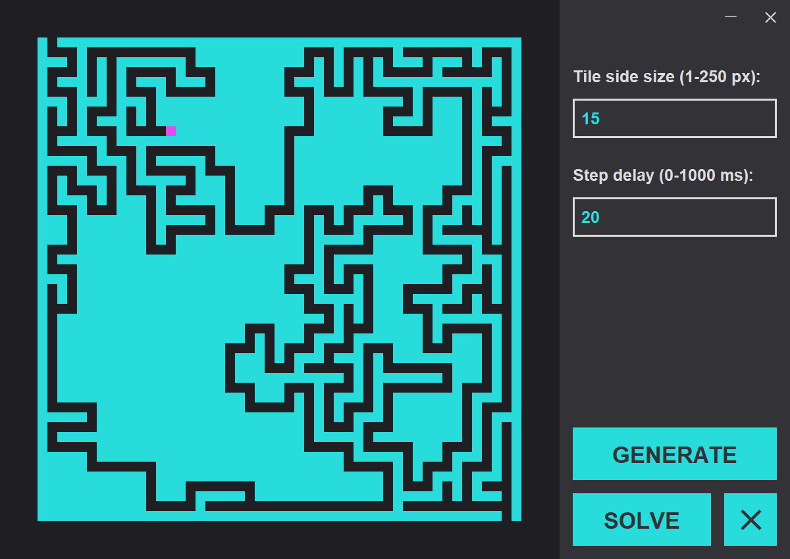

# Maze generator

A personal project made to practice with Swing and multi-thread applications in Java (and because seeing the building and solving proccess of a maze is very relaxing). The application can be downloaded [here](https://github.com/pascualex/maze-generator/releases).

## Characteristics of the application

The most relevant characteristics of the application are:
* The interface is made with Swing.
* It's based on the MVC architecture.
* The logic of the maze runs in its own thread.

## Algorithms used for building and solving the maze

The algorithm used for building the maze is based on the depth-first search algorithm but, instead of using a stack or recursion, the tiles store all the necessary information to make it iterative. This was done to efficiently manage very large mazes.

The "solving" process isn't made by an algorithm, instead the solution is obtained from the information stored in the tiles.

## Application screenshot

